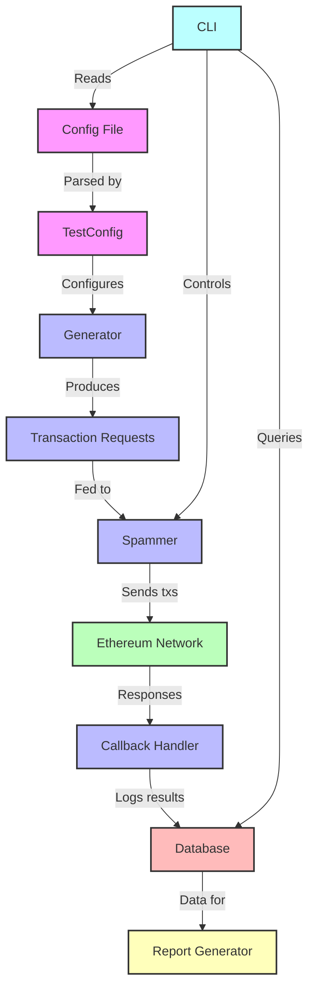

# Contender

Contender is a high-performance Ethereum network spammer and testing tool designed for benchmarking and stress-testing Ethereum clients and networks.

## Features

- **Flexible Transaction Generation**: Create custom transaction patterns using TOML configuration files.
- **Multiple Spamming Modes**: Support for both timed and block-wise spamming.
- **Seed-based Randomization**: Reproducible fuzzing with customizable seed values.
- **Database Integration**: SQLite backend for storing and analyzing test results.
- **Extensible Architecture**: Easy-to-implement custom generators and callbacks.

## Installation

To install Contender, you need to have Rust and Cargo installed on your system. Then, you can build the project from source:

```bash
git clone https://github.com/your-username/contender.git
cd contender
cargo build --release
```

## Usage

Contender can be used as both a library and a command-line tool.

### Command-line Interface

```bash
contender_cli spam <testfile> <rpc_url> [OPTIONS]
contender_cli setup <testfile> <rpc_url>
contender_cli report [OPTIONS]
```

For detailed usage instructions, run:

```bash
contender_cli --help
```

### Library Usage

To use Contender as a library in your Rust project, add it to your `Cargo.toml`:

```toml
[dependencies]
contender = { git = "https://github.com/your-username/contender.git" }
```

Then, you can use it in your code:

```rust
use contender_core::generator::testfile::TestConfig;
use contender_core::spammer::TimedSpammer;

// Load test configuration
let config = TestConfig::from_file("path/to/testfile.toml")?;

// Create a spammer
let spammer = TimedSpammer::new(&generator, callback, "http://localhost:8545");

// Run the spam test
spammer.spam_rpc(100, 60).await?;
```

## Configuration

Contender uses TOML files for test configuration. Here's a basic example:


```1:165:univ2ConfigTest.toml
# Uniswap V2 spammer example configuration

### template variables can be set here, but may be overridden by command line options
### also note: it's up to you to correctly pad these values to the required length and omit a leading 0x, otherwise contract deployments may fail
[env]
feeToSetter = "f39Fd6e51aad88F6F4ce6aB8827279cffFb92266"
initialSupply = "00ffffffffffffffffffffffffffffffffffffffffffffffffffffffffffffff"

### create contracts, refer to them by their names in latter steps using curly braces
[[create]]
name = "weth"

[[create]]
name = "testToken"

[[create]]
# requires {feeToSetter}
name = "uniV2Factory"

[[create]]
name = "uniRouterV2"
# requires {univ2Factory} and {weth}

### setup contracts

## weth deposits ###############################################################

[[setup]]
to = "{weth}"
from = "0xf39Fd6e51aad88F6F4ce6aB8827279cffFb92266"
signature = "function deposit() public payable"
value = "100000000000000000000"

[[setup]]
to = "{weth}"
from = "0x70997970C51812dc3A010C7d01b50e0d17dc79C8"
signature = "function deposit() public payable"
value = "100000000000000000000"

[[setup]]
to = "{weth}"
from = "0x3C44CdDdB6a900fa2b585dd299e03d12FA4293BC"
signature = "function deposit() public payable"
value = "100000000000000000000"

## uniV2 pair: weth/token ######################################################

[[setup]]
to = "{uniV2Factory}"
from = "0xf39Fd6e51aad88F6F4ce6aB8827279cffFb92266"
signature = "function createPair(address tokenA, address tokenB) external returns (address pair)"
args = [
     "{weth}",
     "{testToken}"
]

## token approvals #############################################################

#admin
[[setup]]
to = "{weth}"
from = "0xf39Fd6e51aad88F6F4ce6aB8827279cffFb92266"
signature = "approve(address spender, uint256 amount) returns (bool)"
args = [
     "{uniRouterV2}",
     "0xfffffffffffffffffffffffffffffffffffffffffffffffffffffffffffffff"
]

[[setup]]
to = "{testToken}"
from = "0xf39Fd6e51aad88F6F4ce6aB8827279cffFb92266"
signature = "approve(address spender, uint256 amount) returns (bool)"
args = [
     "{uniRouterV2}",
     "0xfffffffffffffffffffffffffffffffffffffffffffffffffffffffffffffff"
]

# contender1
[[setup]]
to = "{weth}"
from = "0x3C44CdDdB6a900fa2b585dd299e03d12FA4293BC"
signature = "approve(address spender, uint256 amount) returns (bool)"
args = [
     "{uniRouterV2}",
     "0xfffffffffffffffffffffffffffffffffffffffffffffffffffffffffffffff"
]

[[setup]]
to = "{testToken}"
from = "0x3C44CdDdB6a900fa2b585dd299e03d12FA4293BC"
signature = "approve(address spender, uint256 amount) returns (bool)"
args = [
     "{uniRouterV2}",
     "0xfffffffffffffffffffffffffffffffffffffffffffffffffffffffffffffff"
]

# contender2
[[setup]]
to = "{weth}"
from = "0x70997970C51812dc3A010C7d01b50e0d17dc79C8"
signature = "approve(address spender, uint256 amount) returns (bool)"
args = [
     "{uniRouterV2}",
     "0xfffffffffffffffffffffffffffffffffffffffffffffffffffffffffffffff"
]

[[setup]]
to = "{testToken}"
from = "0x70997970C51812dc3A010C7d01b50e0d17dc79C8"
signature = "approve(address spender, uint256 amount) returns (bool)"
args = [
     "{uniRouterV2}",
     "0xfffffffffffffffffffffffffffffffffffffffffffffffffffffffffffffff"
]

## add liquidity ###############################################################

[[setup]]
to = "{uniRouterV2}"
from = "0xf39Fd6e51aad88F6F4ce6aB8827279cffFb92266"
signature = "addLiquidity(address tokenA, address tokenB, uint amountADesired, uint amountBDesired, uint amountAMin, uint amountBMin, address to, uint deadline) returns (uint amountA, uint amountB, uint liquidity)"
args = [
     "{weth}",
     "{testToken}",
     "100000000000000000",
     "100000000000000000000",
     "10000000000000000",
     "10000000000000000000",
     "0xf39Fd6e51aad88F6F4ce6aB8827279cffFb92266",
     "10000000000000"
]

### the spam step will be repeated
[[spam]]
to = "{uniRouterV2}"
from = "0x70997970C51812dc3A010C7d01b50e0d17dc79C8"
signature = "swapExactTokensForTokens(uint256 amountIn, uint256 amountOutMin, address[] path, address to, uint256 deadline) external returns (uint256[] memory)"
args = [
     "1000000000000000000",
     "1000",
     '[{weth}, {testToken}]',
     "0x70997970C51812dc3A010C7d01b50e0d17dc79C8",
     "10000000000000" # TODO: implement block-aware variables for dynamic values like `deadline`. For now, this is just so far in the future I won't be alive to hear about it reverting.
]

[[spam.fuzz]]
param = "amountIn"
min = "1"
max = "100000000000000000"

[[spam]]
to = "{uniRouterV2}"
from = "0x3C44CdDdB6a900fa2b585dd299e03d12FA4293BC"
signature = "swapExactTokensForTokens(uint256 amountIn, uint256 amountOutMin, address[] path, address to, uint256 deadline) external returns (uint256[] memory)"
args = [
     "1000000000000000000",
     "1000",
     '[{weth}, {testToken}]',
     "0x3C44CdDdB6a900fa2b585dd299e03d12FA4293BC",
     "10000000000000"
]
```


## Architecture

Contender is built with a modular architecture:

- **Generators**: Produce transaction requests based on configuration.
- **Spammers**: Send transactions to the network at specified rates.
- **Callbacks**: Handle post-transaction actions and logging.
- **Database**: Store and retrieve test results and contract addresses.



## Contributing

Contributions are welcome! Please feel free to submit a Pull Request.

## License

This project is licensed under the MIT License - see the [LICENSE](LICENSE) file for details.

## Acknowledgements

- The Ethereum community for their continuous innovation.
- The Reth project for inspiration on project structure and documentation.