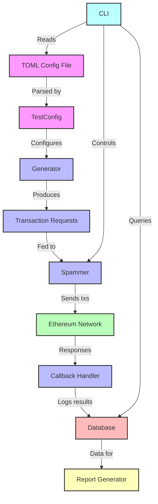

# Contender


[](./LICENSE)

High-performance Ethereum transaction spammer and benchmarking tool.

## 🚀 Quick Start

Install:
```bash
cargo install --git https://github.com/flashbots/contender --locked
```

Run a simple spam scenario:
```bash
contender spam --tps 50 -r $RPC_URL fill-block
```

Run a bundled scenario from the repo:
```bash
contender setup scenario:stress.toml -r $RPC_URL -p $PRIVATE_KEY
contender spam  scenario:stress.toml -r $RPC_URL --tps 10 -d 3
```

See [examples](docs/examples.md) for more usage patterns.


## ⚙️ Prerequisites

- **Rust toolchain** (latest stable)
- **SQLite development headers** (`libsqlite3-dev` on Linux)
- A JSON-RPC endpoint for the target Ethereum node

## 📚 Docs

To use Contender as a library in your Rust project, add the crates you need to your `Cargo.toml`:

```toml
[dependencies]
...
contender_core = { git = "https://github.com/flashbots/contender" }
contender_sqlite = { git = "https://github.com/flashbots/contender" }
contender_testfile = { git = "https://github.com/flashbots/contender" }
# not necessarily required, but recommended:
tokio = { version = "1.40.0", features = ["rt-multi-thread"] }
```

See [here](https://github.com/flashbots/contender/blob/main/crates/cli/src/commands/spam.rs) and [here](https://github.com/flashbots/rbuilder/compare/develop...feat/contender-in-tester) for examples of Contender being used as a library.

## Scenario Configuration

Contender uses TOML files to define scenarios. Single brackets `[]` indicate the item may only be specified once. Double brackets `[[]]` indicate an array, which allows the directive to be specified multiple times.

The key directives are:

- `[env]`: Defines environment variables that can be used throughout the configuration.

- `[[create]]`: Specifies contracts to be deployed. Each entry represents a contract creation.

- `[[setup]]`: Defines setup transactions to be executed before the main spam test. These are typically used for initializing contracts or setting up test conditions.

- `[[spam]]`: Describes the transactions to be repeatedly sent during the spam test. These form the core of the network stress test.

  - Spam directives can send bundles or single txs. 

  - `[[spam.bundle.tx]]` defines transactions in a bundle

  - `[spam.tx]` defines a single transaction

  - Each tx directive can include various fields such as `to`, `from`, `signature`, `args`, `value`, and `gas_limit` to specify the details of the transactions or contract interactions.

  - `[[spam.bundle.tx.fuzz]]` or `[[spam.tx.fuzz]]`: Configures fuzzing parameters for specific fields in spam transactions, allowing for randomized inputs or ETH values within defined ranges.

### Placeholders

Placeholders may be used to specify contract addresses, the sender's address, or any variables you specify in `[env]`.

In `[[create]]` transactions, placeholders are supported in the `bytecode` field and in `args` (constructor args). The special `{_sender}` placeholder is injected into `bytecode` as the sender address without the `0x` prefix.

In `[[setup]]` and `[[spam]]` transactions, placeholders are supported in the following fields: `to`, `args`, & `value`.

`{_sender}` is a special placeholder that gets replaced with the `from` address at runtime.

**Examples**

Contract address placeholder:

```toml
[[create]]
name = "weth"
...

[[create]]
name = "testToken"
...

[[setup]]
kind = "univ2_create_pair"
to = "{uniV2Factory}"
from_pool = "admin"
signature = "function createPair(address tokenA, address tokenB) external returns (address pair)"
args = [
     "{weth}",
     "{testToken}"
]
```

Constructor args with placeholders:

```toml
[env]
initialSupply = "1000000000000000000" # 1e18

[[create]]
name = "testToken"
from_pool = "admin"
signature = "(uint256 initialSupply)" # or "constructor(uint256 initialSupply)"
args = [
     "{initialSupply}",
]
bytecode = "0x60806040..." # no manual zero-padding needed; args are ABI-encoded and appended automatically
```

Sender address placeholder:

```toml
[[setup]]
kind = "admin_univ2_add_liquidity_weth-testToken"
to = "{uniRouterV2}"
from_pool = "admin"
signature = "addLiquidity(address tokenA, address tokenB, uint amountADesired, uint amountBDesired, uint amountAMin, uint amountBMin, address to, uint deadline) returns (uint amountA, uint amountB, uint liquidity)"
args = [
     "{weth}",
     "{testToken}",
     "2500000000000000000",
     "50000000000000000000000",
     "100000000000000",
     "5000000000000000",
     "{_sender}",
     "10000000000000"
]
```

See [docs/creating_scenarios.md](./docs/creating_scenarios.md) for a full walkthrough, including environment variables, placeholders, setup/spam steps, and examples. For passing constructor args in `[[create]]` using `signature` and `args` (no manual zero-padding), see [docs/constructor_args.md](./docs/constructor_args.md).

## Architecture

Contender is built with a modular architecture:

- **Generators**: Produce transaction requests based on configuration.
- **Spammers**: Send transactions to the network at specified rates.
- **Callbacks**: Handle post-transaction actions and logging.
- **Database**: Store and retrieve test results and contract addresses.



Contender is a high-performance Ethereum transaction spammer and benchmarking tool, built for repeatable load tests against EL clients and live networks.
It supports both **per-second** (TPS) and **per-block** (TPB) timing, seeded fuzzing for reproducibility, and SQLite-backed state for contracts, runs, and reports.


### 1. Introduction
- [Overview](docs/overview.md)

### 2. Getting Started
- [Installation](docs/installation.md)
- [CLI Reference](docs/cli.md)
- [Example Commands](docs/examples.md)

### 3. Writing Scenarios
- [Scenario File Structure](docs/scenarios.md)
- [Placeholders](docs/placeholders.md)
- [Creating a New Scenario](docs/creating_scenarios.md)

### 4. Advanced Usage
- [Engine API Spamming](docs/engine-api.md)
- [Reports, Database, and Admin Tools](docs/reports-db-admin.md)
- [Using Contender as a Library](docs/library-usage.md)

### 5. Internals
- [Architecture](docs/architecture.md)
