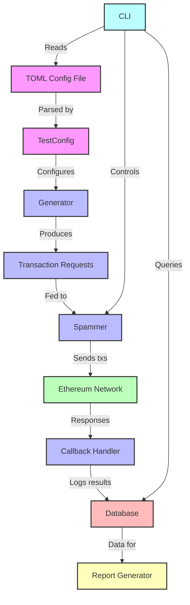

# Contender


Contender is a high-performance Ethereum network spammer and testing tool designed for benchmarking and stress-testing Ethereum clients and networks.

## Features

- **Flexible Transaction Generation**: Create custom transaction patterns using TOML configuration files.
- **Multiple Spamming Modes**: Support for both timed and block-wise spamming.
- **Seed-based Randomization**: Reproducible fuzzing with customizable seed values.
- **Database Integration**: SQLite backend to store contract/transaction data and analyze test results.
- **Extensible Architecture**: Easy-to-implement custom generators and callbacks.

## Installation

To install the Contender CLI, you need to have the [Rust toolchain](https://rustup.rs/) and [libsqlite3-dev](https://packages.debian.org/sid/libsqlite3-dev) installed on your system. Then install from github:

```bash
cargo install --git https://github.com/flashbots/contender --bin contender
```

You may also want to clone the repo to use the built-in scenarios:

```sh
git clone https://github.com/flashbots/contender
cd contender
```

## Usage

*See [the docs](./docs/) for detailed explanations and examples.*

Contender can be used as both a library and a command-line tool.

### Command-line Interface

```bash
contender setup <testfile> <rpc_url> [OPTIONS]
contender spam <testfile> <rpc_url> [OPTIONS]
contender report [OPTIONS]
contender run [OPTIONS]
```

For detailed usage instructions, run:

```bash
contender --help
```

#### Example Calls

Run a zero-config scenario that attempts to fill a block to its gas limit:

```bash
contender run fill-block $RPC_URL
```

Send txs every 1 second instead of the default 12s:

```bash
contender run fill-block $RPC_URL -i 1
```

Pass a private key to send txs from your own account:

```bash
contender run fill-block $RPC_URL -i 1 -p $PRIVATE_KEY
```

---

Deploy custom scenario:

```bash
contender setup ./scenarios/stress.toml $RPC_URL
```

Pass a private key to fund the setup txs from your own account (default anvil account[0] is used otherwise):

```bash
contender setup ./scenarios/stress.toml $RPC_URL -p $PRIVATE_KEY
```

---

Run the spammer with a custom scenario (10 tx/sec for 3 seconds):

```bash
contender spam ./scenarios/stress.toml $RPC_URL --tps 10 -d 3
```

Setting `--tps` defines the number of "agent accounts" (generated EOAs used to send txs). The number of accounts each agent has is determined by `txs_per_period / num_agents`, where `num_agents` is defined by the scenario. For example, if the `stress.toml` scenario has 4 agents (defined by `from_pool` declarations), passing `--tps` 10 will generate `10 / 4 = 2.5` accounts, rounded down.

Pass a private key with `-p` to fund agent accounts from your account:

```bash
contender spam ./scenarios/stress.toml $RPC_URL --tps 10 -d 3 -p $PRV_KEY
```

---

Generate a chain performance report for the most recent run.

```bash
contender report $RPC_URL
```

> The compiled report will open in your web browser.

Generate a report that spans the last 3 runs (the most recent run + 2 preceding it):

```bash
contender report $RPC_URL -p 2
```

Generate a report spanning run 200 - 203 (inclusively):

```bash
contender report $RPC_URL -i 203 -p 3
```

---

Backup the SQLite DB used by contender:

```bash
contender db export ./backup.db
```

Import a backup DB file for contender to use:

```bash
contender db import ./backup.db
```

Reset your DB in-place:

```bash
contender db reset
```

Delete your DB:

```bash
contender db drop
```

### Scenarios

A "scenario" in contender defines contracts to be deployed and transaction calls that should run before and during a spam session.

We provide some scenarios in the repo under the [`scenarios/`](./scenarios/) directory. To run these, you'll need to clone the repo:

```sh
git clone https://github.com/flashbots/contender
cd contender
cargo run -- setup ./scenarios/stress.toml $RPC_URL -p $PRIVATE_KEY
cargo run -- spam ./scenarios/stress.toml $RPC_URL --tps 10 -d 3 -p $PRIVATE_KEY
```

### Library Usage

To use Contender as a library in your Rust project, add the crates you need to your `Cargo.toml`:

```toml
[dependencies]
...
contender_core = { git = "https://github.com/flashbots/contender" }
contender_sqlite = { git = "https://github.com/flashbots/contender" }
contender_testfile = { git = "https://github.com/flashbots/contender" }
# not necessarily required, but recommended:
tokio = { version = "1.40.0", features = ["rt-multi-thread"] }
```

```rust
use contender_core::{
    db::DbOps,
    generator::RandSeed,
    spammer::{BlockwiseSpammer, TimedSpammer, NilCallback, LogCallback},
    test_scenario::TestScenario,
};
use contender_sqlite::SqliteDb;
use contender_testfile::TestConfig;

#[tokio::main]
async fn main() -> Result<(), Box<dyn std::error::Error>> {
    let db = &SqliteDb::new_memory();
    db.create_tables()?;
    let cfg = TestConfig::from_file("testfile.toml")?;
    let mut agents = AgentStore::new();
    let rand_seed = RandSeed::new();
    agents.add_random_agent(
        "agentName",
        4, // number of random signers to create
        rand_seed
    )
    let scenario = TestScenario::new(
        cfg,
        db.to_owned().into(),
        "http://localhost:8545".parse::<_>()?,
        None,
        rand_seed,
        &[
            "0xac0974bec39a17e36ba4a6b4d238ff944bacb478cbed5efcae784d7bf4f2ff80",
            "0x59c6995e998f97a5a0044966f0945389dc9e86dae88c7a8412f4603b6b78690d",
            "0x5de4111afa1a4b94908f83103eb1f1706367c2e68ca870fc3fb9a804cdab365a",
        ]
        .iter()
        .map(|s| s.parse::<_>().unwrap())
        .collect::<Vec<_>>(),
        agents
    );

    if db.get_named_tx("MyContract").is_err() {
        scenario.deploy_contracts().await?;
        scenario.run_setup().await?;
    }

    let spammer = TimedSpammer::new(std::time::Duration::from_secs(1));
    // or
    // let spammer = BlockwiseSpammer {};

    // callback is triggered when tx/bundle request is sent
    // NilCallback does nothing, LogCallback writes tx data to DB
    let tx_callback = LogCallback::new(scenario.rpc_client().clone());
    // or
    // let tx_callback = NilCallback;

    // placeholder; this should identify the run in the DB
    let run_id = 1_u64;
    
    // send 20 requests per second, over 10 seconds
    spammer.spam_rpc(&mut scenario, 20, 10, Some(run_id), tx_callback.into()).await?;

    Ok(())
}
```

## Scenario Configuration

Contender uses TOML files to define scenarios. Single brackets `[]` indicate the item may only be specified once. Double brackets `[[]]` indicate an array, which allows the directive to be specified multiple times.

The key directives are:

- `[env]`: Defines environment variables that can be used throughout the configuration.

- `[[create]]`: Specifies contracts to be deployed. Each entry represents a contract creation.

- `[[setup]]`: Defines setup transactions to be executed before the main spam test. These are typically used for initializing contracts or setting up test conditions.

- `[[spam]]`: Describes the transactions to be repeatedly sent during the spam test. These form the core of the network stress test.

  - Spam directives can send bundles or single txs. 

  - `[[spam.bundle.tx]]` defines transactions in a bundle

  - `[spam.tx]` defines a single transaction

  - Each tx directive can include various fields such as `to`, `from`, `signature`, `args`, `value`, and `gas_limit` to specify the details of the transactions or contract interactions.

  - `[[spam.bundle.tx.fuzz]]` or `[[spam.tx.fuzz]]`: Configures fuzzing parameters for specific fields in spam transactions, allowing for randomized inputs or ETH values within defined ranges.

### Placeholders

Placeholders may be used to specify contract addresses, the sender's address, or any variables you specify in `[env]`.

In `[[create]]` transactions, placeholders are supported in the `bytecode` field only.

In `[[setup]]` and `[[spam]]` transactions, placeholders are supported in the following fields: `to`, `args`, & `value`.

`{_sender}` is a special placeholder that gets replaced with the `from` address at runtime.

**Examples**

Contract address placeholder:

```toml
[[create]]
name = "weth"
...

[[create]]
name = "testToken"
...

[[setup]]
kind = "univ2_create_pair"
to = "{uniV2Factory}"
from_pool = "admin"
signature = "function createPair(address tokenA, address tokenB) external returns (address pair)"
args = [
     "{weth}",
     "{testToken}"
]
```

Custom variable placeholder:

```toml
[env]
initialSupply = "00ffffffffffffffffffffffffffffffffffffffffffffffffffffffffffffff"

[[create]]
name = "testToken"
from_pool = "admin"
# pass {initialSupply} as a constructor argument (must be exactly 32 bytes long)
bytecode = "0x60806040...{initialSupply}"
```

Sender address placeholder:

```toml
[[setup]]
kind = "admin_univ2_add_liquidity_weth-testToken"
to = "{uniRouterV2}"
from_pool = "admin"
signature = "addLiquidity(address tokenA, address tokenB, uint amountADesired, uint amountBDesired, uint amountAMin, uint amountBMin, address to, uint deadline) returns (uint amountA, uint amountB, uint liquidity)"
args = [
     "{weth}",
     "{testToken}",
     "2500000000000000000",
     "50000000000000000000000",
     "100000000000000",
     "5000000000000000",
     "{_sender}",
     "10000000000000"
]
```

See [scenarios/](./scenarios/) for examples.

## Architecture

Contender is built with a modular architecture:

- **Generators**: Produce transaction requests based on configuration.
- **Spammers**: Send transactions to the network at specified rates.
- **Callbacks**: Handle post-transaction actions and logging.
- **Database**: Store and retrieve test results and contract addresses.



## Contributing

Contributions are welcome! Please feel free to submit a Pull Request.

## License

This project is licensed under the MIT License - see the [LICENSE](LICENSE) file for details.

## Acknowledgements

- The Ethereum community for their continuous innovation.
- The Reth project for inspiration on project structure and documentation.
- [alloy-rs](https://github.com/alloy-rs) -- the backbone of this project.
