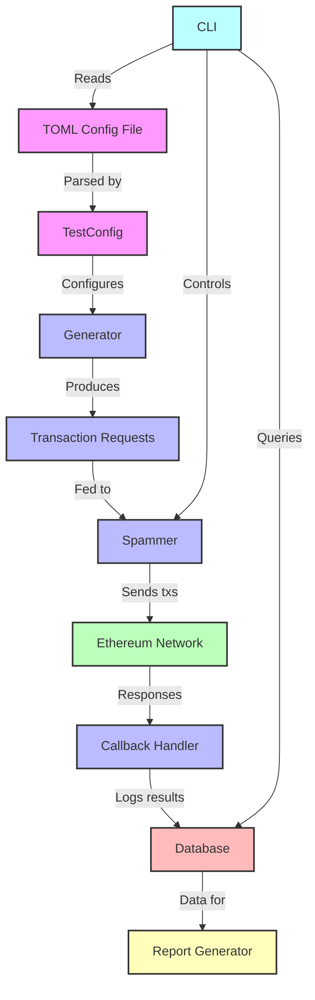

# Contender


Contender is a high-performance Ethereum network spammer and testing tool designed for benchmarking and stress-testing Ethereum clients and networks.

## Features

- **Flexible Transaction Generation**: Create custom transaction patterns using TOML configuration files.
- **Multiple Spamming Modes**: Support for both timed and block-wise spamming.
- **Seed-based Randomization**: Reproducible fuzzing with customizable seed values.
- **Database Integration**: SQLite backend to store contract/transaction data and analyze test results.
- **Extensible Architecture**: Easy-to-implement custom generators and callbacks.

## Installation

To install the Contender CLI, you need to have the [Rust toolchain](https://rustup.rs/) and [libsqlite3-dev](https://packages.debian.org/sid/libsqlite3-dev) installed on your system. Then install from github:

```bash
cargo install --git https://github.com/flashbots/contender --bin contender
```

You may also want to clone the repo to use the built-in scenarios:

```sh
git clone https://github.com/flashbots/contender
cd contender
```

## Usage

*See [the docs](./docs/) for detailed explanations and examples.*

Contender can be used as both a library and a command-line tool.

### Command-line Interface

```bash
contender setup <testfile> [OPTIONS]
contender spam <testfile> [OPTIONS]
contender report [OPTIONS]
contender run [OPTIONS]
contender admin [OPTIONS]
```

For detailed usage instructions, run:

```bash
contender --help
```

#### Example Calls

Run a zero-config scenario that attempts to fill a block to its gas limit:

```bash
contender run fill-block -r $RPC_URL
```

Send txs every 1 second instead of the default 12s:

```bash
contender run fill-block -r $RPC_URL -i 1
```

Pass a private key to send txs from your own account:

```bash
contender run fill-block -r $RPC_URL -i 1 -p $PRIVATE_KEY
```

---

Deploy custom scenario:

```bash
contender setup ./scenarios/stress.toml -r $RPC_URL
```

Pass a private key to fund the setup txs from your own account (default anvil account[0] is used otherwise):

```bash
contender setup ./scenarios/stress.toml -r $RPC_URL -p $PRIVATE_KEY
```

---

Run the spammer with a custom scenario (10 tx/sec for 3 seconds):

```bash
contender spam ./scenarios/stress.toml -r $RPC_URL --tps 10 -d 3
```

Setting `--tps` defines the number of "agent accounts" (generated EOAs used to send txs). The number of accounts each agent has is determined by `txs_per_period / num_agents`, where `num_agents` is defined by the scenario. For example, if the `stress.toml` scenario has 4 agents (defined by `from_pool` declarations), passing `--tps` 10 will generate `10 / 4 = 2.5` accounts, rounded down.

Pass a private key with `-p` to fund agent accounts from your account:

```bash
contender spam ./scenarios/stress.toml -r $RPC_URL --tps 10 -d 3 -p $PRV_KEY
```

Generate a report immediately following a spam run:

```bash
contender spam ./scenarios/stress.toml -r $RPC_URL --tps 10 -d 3 -p $PRV_KEY --gen-report
```

---

Run spammer indefinitely:

```bash
contender spamd ./scenarios/stress.toml -r $RPC_URL --tps 10 -d 3 -p $PRV_KEY
```

Run spammer for 5 minutes:

```bash
contender spamd ./scenarios/stress.toml -r $RPC_URL --tps 10 -d 3 -p $PRV_KEY --tl $((60 * 5))
```

---

Generate a chain performance report for the most recent run.

```bash
contender report
```

> The compiled report will open in your web browser.

Generate a report that spans the last 3 runs (the most recent run + 2 preceding it):

```bash
contender report -p 2
```

Generate a report spanning run 200 - 203 (inclusively):

```bash
contender report -i 203 -p 3
```

---

**Overriding [env] values**

You may manually override any `[env]` variable (or add new ones) in a scenario file by passing `-e <KEY=VALUE>` with your spam/setup commands.

The following example will replace the value for `{testAddr}` in `example.toml`:

```toml
# example.toml
...

[[spam]]
[spam.tx]
to = "{testAddr}"
from_pool = "spammers"
signature = "call()"
args = []
```

In this case, we're using `{testAddr}` for the spam tx's `to` address, so we'll be sending transactions to the address we provide with `-e`:

```bash
contender spam example.toml --tps 10 \
-e testAddr=0x0000000000000000000000000000000000000013
```

---

**Spamming with the `engine_` API**

Add the following flags to `setup`, `spam`, or `spamd` to trigger block building manually via the authenticated `engine_` API:

- `--jwt <jwt secret file>` the path to your node's secret JWT file
- `--auth <auth RPC URL>` the node's the auth API URL
- `--fcu` set this to trigger block building

If targeting an Optimism node, you'll also need to add the `--op` flag.

```bash
# default
cargo run -- spamd ./scenarios/stress.toml -r $RPC \
--auth http://localhost:8551 \
--jwt $JWT_FILE \
--fcu \
--tps 200 -d 2 -w 3

# example targeting local op-rbuilder
cargo run -- spamd ./scenarios/stress.toml -r http://localhost:1111 \
--auth http://localhost:4444 \
--jwt $CODE/rbuilder/crates/op-rbuilder/src/tester/fixtures/test-jwt-secret.txt \
--fcu \
--op \
--tps 200 -d 2 -w 3
```

---

Backup the SQLite DB used by contender:

```bash
contender db export ./backup.db
```

Import a backup DB file for contender to use:

```bash
contender db import ./backup.db
```

Reset your DB in-place:

```bash
contender db reset
```

Delete your DB:

```bash
contender db drop
```

---

Contender also has some admin features for debugging...

List the accounts that contender generates for a given `from_pool` definition:

```bash
# list 100 agent accounts from the "spammers" pool
contender admin accounts --from-pool "spammers" -n 100
```

These accounts are generated from your locally-stored seed, which can be viewed with the following:

```bash
contender admin seed
```

We can also view the latest run ID from the local DB, which can be useful for DB debugging:

```bash
contender admin latest-run-id
```

### Scenarios

A "scenario" in contender defines contracts to be deployed and transaction calls that should run before and during a spam session.

We provide some scenarios in the repo under the [`scenarios/`](./scenarios/) directory. To run these, you'll need to clone the repo:

```sh
git clone https://github.com/flashbots/contender
cd contender
cargo run -- setup ./scenarios/stress.toml -r $RPC_URL -p $PRIVATE_KEY
cargo run -- spam ./scenarios/stress.toml -r $RPC_URL --tps 10 -d 3 -p $PRIVATE_KEY
```

### Library Usage

To use Contender as a library in your Rust project, add the crates you need to your `Cargo.toml`:

```toml
[dependencies]
...
contender_core = { git = "https://github.com/flashbots/contender" }
contender_sqlite = { git = "https://github.com/flashbots/contender" }
contender_testfile = { git = "https://github.com/flashbots/contender" }
# not necessarily required, but recommended:
tokio = { version = "1.40.0", features = ["rt-multi-thread"] }
```

See [here](https://github.com/flashbots/contender/blob/main/crates/cli/src/commands/spam.rs) and [here](https://github.com/flashbots/rbuilder/compare/develop...feat/contender-in-tester) for examples of Contender being used as a library.

## Scenario Configuration

Contender uses TOML files to define scenarios. Single brackets `[]` indicate the item may only be specified once. Double brackets `[[]]` indicate an array, which allows the directive to be specified multiple times.

The key directives are:

- `[env]`: Defines environment variables that can be used throughout the configuration.

- `[[create]]`: Specifies contracts to be deployed. Each entry represents a contract creation.

- `[[setup]]`: Defines setup transactions to be executed before the main spam test. These are typically used for initializing contracts or setting up test conditions.

- `[[spam]]`: Describes the transactions to be repeatedly sent during the spam test. These form the core of the network stress test.

  - Spam directives can send bundles or single txs. 

  - `[[spam.bundle.tx]]` defines transactions in a bundle

  - `[spam.tx]` defines a single transaction

  - Each tx directive can include various fields such as `to`, `from`, `signature`, `args`, `value`, and `gas_limit` to specify the details of the transactions or contract interactions.

  - `[[spam.bundle.tx.fuzz]]` or `[[spam.tx.fuzz]]`: Configures fuzzing parameters for specific fields in spam transactions, allowing for randomized inputs or ETH values within defined ranges.

### Placeholders

Placeholders may be used to specify contract addresses, the sender's address, or any variables you specify in `[env]`.

In `[[create]]` transactions, placeholders are supported in the `bytecode` field only.

In `[[setup]]` and `[[spam]]` transactions, placeholders are supported in the following fields: `to`, `args`, & `value`.

`{_sender}` is a special placeholder that gets replaced with the `from` address at runtime.

**Examples**

Contract address placeholder:

```toml
[[create]]
name = "weth"
...

[[create]]
name = "testToken"
...

[[setup]]
kind = "univ2_create_pair"
to = "{uniV2Factory}"
from_pool = "admin"
signature = "function createPair(address tokenA, address tokenB) external returns (address pair)"
args = [
     "{weth}",
     "{testToken}"
]
```

Custom variable placeholder:

```toml
[env]
initialSupply = "00ffffffffffffffffffffffffffffffffffffffffffffffffffffffffffffff"

[[create]]
name = "testToken"
from_pool = "admin"
# pass {initialSupply} as a constructor argument (must be exactly 32 bytes long)
bytecode = "0x60806040...{initialSupply}"
```

Sender address placeholder:

```toml
[[setup]]
kind = "admin_univ2_add_liquidity_weth-testToken"
to = "{uniRouterV2}"
from_pool = "admin"
signature = "addLiquidity(address tokenA, address tokenB, uint amountADesired, uint amountBDesired, uint amountAMin, uint amountBMin, address to, uint deadline) returns (uint amountA, uint amountB, uint liquidity)"
args = [
     "{weth}",
     "{testToken}",
     "2500000000000000000",
     "50000000000000000000000",
     "100000000000000",
     "5000000000000000",
     "{_sender}",
     "10000000000000"
]
```

See [scenarios/](./scenarios/) for examples.

## Architecture

Contender is built with a modular architecture:

- **Generators**: Produce transaction requests based on configuration.
- **Spammers**: Send transactions to the network at specified rates.
- **Callbacks**: Handle post-transaction actions and logging.
- **Database**: Store and retrieve test results and contract addresses.



## Contributing

Contributions are welcome! Please feel free to submit a Pull Request.

## License

This project is licensed under the MIT License - see the [LICENSE](LICENSE) file for details.

## Acknowledgements

- The Ethereum community for their continuous innovation.
- The Reth project for inspiration on project structure and documentation.
- [alloy-rs](https://github.com/alloy-rs) -- the backbone of this project.
