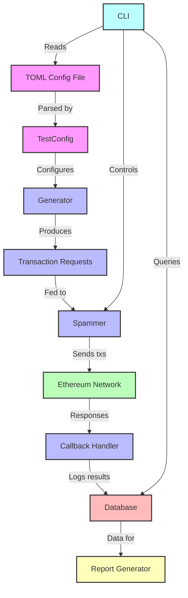

# Contender

[][gh-ci]

Contender is a high-performance Ethereum network spammer and testing tool designed for benchmarking and stress-testing Ethereum clients and networks.

## Features

- **Flexible Transaction Generation**: Create custom transaction patterns using TOML configuration files.
- **Multiple Spamming Modes**: Support for both timed and block-wise spamming.
- **Seed-based Randomization**: Reproducible fuzzing with customizable seed values.
- **Database Integration**: SQLite backend to store contract/transaction data and analyze test results.
- **Extensible Architecture**: Easy-to-implement custom generators and callbacks.

## Installation

To install Contender, you need to have the [Rust toolchain](https://rustup.rs/) installed on your system. Then build the project from source:

```bash
git clone https://github.com/your-username/contender.git
cd contender
cargo build --release
alias contender="$PWD/target/release/contender_cli"
```

## Usage

Contender can be used as both a library and a command-line tool.

### Command-line Interface

```bash
contender setup <testfile> <rpc_url>
contender spam <testfile> <rpc_url> [OPTIONS]
contender report [OPTIONS]
```

For detailed usage instructions, run:

```bash
contender --help
```

### Library Usage

To use Contender as a library in your Rust project, add it to your `Cargo.toml`:

```toml
[dependencies]
...
contender = { git = "https://github.com/zeroXbrock/contender.git" }
```

You'll probably also want to use an async runtime such as `tokio`, which we use in the following example.

```rust
use contender_core::{
    db::{database::DbOps, sqlite::SqliteDb},
    generator::{testfile::NilCallback, RandSeed, TestConfig},
    spammer::BlockwiseSpammer,
    test_scenario::TestScenario,
};

#[tokio::main]
async fn main() -> Result<(), Box<dyn std::error::Error>> {
    let db = &SqliteDb::new_memory();
    db.create_tables()?;
    let cfg = TestConfig::from_file("testfile.toml")?;
    let scenario = TestScenario::new(
        cfg,
        db.to_owned().into(),
        "http://localhost:8545".parse::<_>()?,
        RandSeed::new(),
        &[
            "0xac0974bec39a17e36ba4a6b4d238ff944bacb478cbed5efcae784d7bf4f2ff80",
            "0x59c6995e998f97a5a0044966f0945389dc9e86dae88c7a8412f4603b6b78690d",
            "0x5de4111afa1a4b94908f83103eb1f1706367c2e68ca870fc3fb9a804cdab365a",
        ]
        .iter()
        .map(|s| s.parse::<_>().unwrap())
        .collect::<Vec<_>>(),
    );

    if db.get_named_tx("MyContract").is_err() {
        scenario.deploy_contracts().await?;
        scenario.run_setup().await?;
    }

    let spammer = BlockwiseSpammer::new(scenario, NilCallback);
    spammer.spam_rpc(20, 10, None).await?;

    Ok(())
}
```

## Configuration

Contender uses TOML files for test configuration. The key directives are:

- `[env]`: Defines environment variables that can be used throughout the configuration.

- `[[create]]`: Specifies contracts to be deployed. Each entry represents a contract creation.

- `[[setup]]`: Defines setup transactions to be executed before the main spam test. These are typically used for initializing contracts or setting up test conditions.

- `[[spam]]`: Describes the transactions to be repeatedly sent during the spam test. These form the core of the network stress test.

- `[[spam.fuzz]]`: (Sub-directive of `spam`) Configures fuzzing parameters for specific fields in spam transactions, allowing for randomized inputs within defined ranges.

Each directive can include various fields such as `to`, `from`, `signature`, `args`, and `value` to specify the details of the transactions or contract interactions.

## Architecture

Contender is built with a modular architecture:

- **Generators**: Produce transaction requests based on configuration.
- **Spammers**: Send transactions to the network at specified rates.
- **Callbacks**: Handle post-transaction actions and logging.
- **Database**: Store and retrieve test results and contract addresses.



## Contributing

Contributions are welcome! Please feel free to submit a Pull Request.

## License

This project is licensed under the MIT License - see the [LICENSE](LICENSE) file for details.

## Acknowledgements

- The Ethereum community for their continuous innovation.
- The Reth project for inspiration on project structure and documentation.
