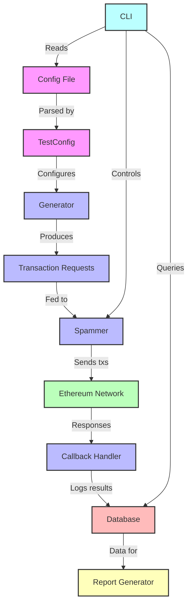

# Contender

Contender is a high-performance Ethereum network spammer and testing tool designed for benchmarking and stress-testing Ethereum clients and networks.

## Features

- **Flexible Transaction Generation**: Create custom transaction patterns using TOML configuration files.
- **Multiple Spamming Modes**: Support for both timed and block-wise spamming.
- **Seed-based Randomization**: Reproducible fuzzing with customizable seed values.
- **Database Integration**: SQLite backend for storing and analyzing test results.
- **Extensible Architecture**: Easy-to-implement custom generators and callbacks.

## Installation

To install Contender, you need to have Rust and Cargo installed on your system. Then, you can build the project from source:

```bash
git clone https://github.com/your-username/contender.git
cd contender
cargo build --release
```

## Usage

Contender can be used as both a library and a command-line tool.

### Command-line Interface

```bash
contender_cli spam <testfile> <rpc_url> [OPTIONS]
contender_cli setup <testfile> <rpc_url>
contender_cli report [OPTIONS]
```

For detailed usage instructions, run:

```bash
contender_cli --help
```

### Library Usage

To use Contender as a library in your Rust project, add it to your `Cargo.toml`:

```toml
[dependencies]
contender = { git = "https://github.com/your-username/contender.git" }
```

Then, you can use it in your code:

```rust
use contender_core::generator::testfile::TestConfig;
use contender_core::spammer::TimedSpammer;

// Load test configuration
let config = TestConfig::from_file("path/to/testfile.toml")?;

// Create a spammer
let spammer = TimedSpammer::new(&generator, callback, "http://localhost:8545");

// Run the spam test
spammer.spam_rpc(100, 60).await?;
```

## Configuration

Contender uses TOML files for test configuration. The key directives are:

- `[env]`: Defines environment variables that can be used throughout the configuration.

- `[[create]]`: Specifies contracts to be deployed. Each entry represents a contract creation.

- `[[setup]]`: Defines setup transactions to be executed before the main spam test. These are typically used for initializing contracts or setting up test conditions.

- `[[spam]]`: Describes the transactions to be repeatedly sent during the spam test. These form the core of the network stress test.

- `[[spam.fuzz]]`: (Sub-directive of `spam`) Configures fuzzing parameters for specific fields in spam transactions, allowing for randomized inputs within defined ranges.

Each directive can include various fields such as `to`, `from`, `signature`, `args`, and `value` to specify the details of the transactions or contract interactions.


## Architecture

Contender is built with a modular architecture:

- **Generators**: Produce transaction requests based on configuration.
- **Spammers**: Send transactions to the network at specified rates.
- **Callbacks**: Handle post-transaction actions and logging.
- **Database**: Store and retrieve test results and contract addresses.



## Contributing

Contributions are welcome! Please feel free to submit a Pull Request.

## License

This project is licensed under the MIT License - see the [LICENSE](LICENSE) file for details.

## Acknowledgements

- The Ethereum community for their continuous innovation.
- The Reth project for inspiration on project structure and documentation.