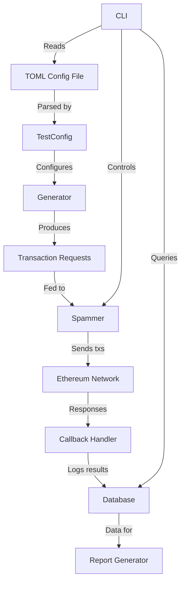

# Architecture

Modular components:
- **Generators** build transaction requests from config
- **Spammers** schedule and send txs
- **Callbacks** handle responses and logging
- **Database** persists deployments and test data
- **CLI** orchestrates runs and reporting

